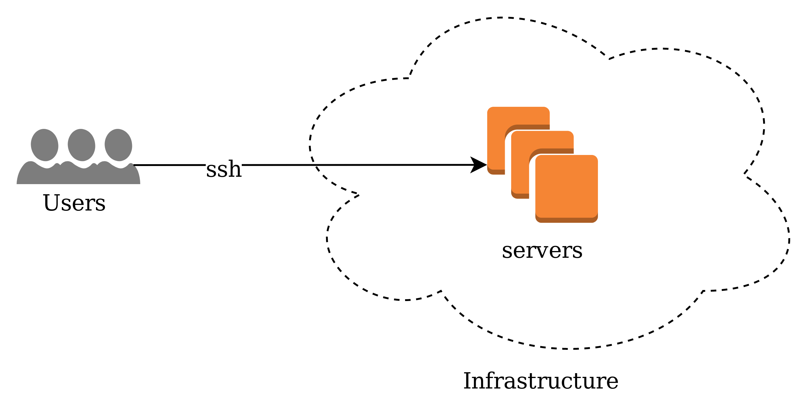
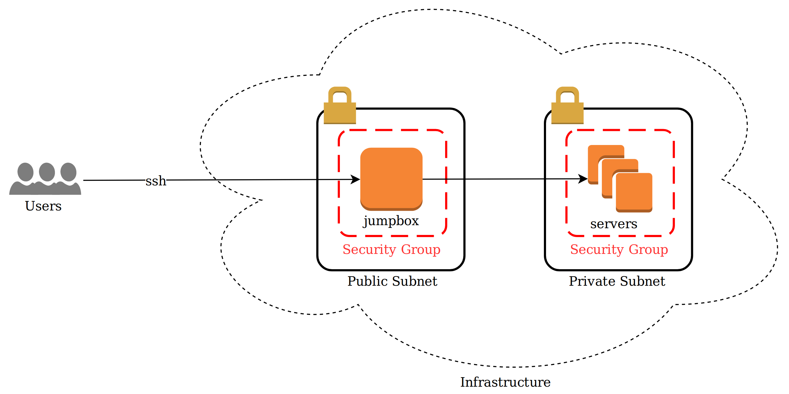

# Overview

[Bastion Host](https://en.wikipedia.org/wiki/Bastion_host) or [jump host / jumpbox](https://en.wikipedia.org/wiki/Jump_server), works as a dedicated server used as a central point for providing access to internal network.

Internal applications in an internal server are likely to be firewalled and accessible only via an internal network. Some of these applications may be on-premise, and others are "in the cloud", provided by a [IAAS](https://searchcloudcomputing.techtarget.com/definition/Infrastructure-as-a-Service-IaaS) such as [Amazon AWS](https://aws.amazon.com/), [Microsoft Azure](https://azure.microsoft.com/), or [Digital Ocean](https://www.digitalocean.com/). 

Debugging an internal application in this sense from a connection on the public internet means that one has to directly be able to SSH into the internal server.



A jump host acts as an intermediary to securely access these internal systems while being accessible from the public internet. The jump host is easier to audit and is a single source of truth for all secure connections inbound to it.



This repository serves as an example of a jump host / bastion host with an attempt on secure hardening and supports [Google Authenticator](https://github.com/google/google-authenticator) Time-based One-time Password (TOTP).

## Development

### Prerequisites

To develop in this repository, this is a list of prerequisites to setup.

* Install [python 2.7](https://www.python.org/downloads/)

* Install [python-pip](https://pypi.org/project/pip/)

* Install [boto](https://github.com/boto/boto)

* Run the script below to setup your [virtualenv](https://virtualenv.pypa.io/en/stable/) so [Ansible](https://www.ansible.com) can be installed with the project.

```sh
    cd playbook
    virtualenv .
    source ./bin/activate
    pip install ansible
```

* Install and setup [credstash](https://github.com/fugue/credstash) for storing Google TOTP secret key in [AWS DynamoDB](https://aws.amazon.com/dynamodb/).

* Run `generate-keys.sh` to generate two users (`user1` and `user2`) in the public key repository for testing purposes.

## Developers

The `vault` aws-config file is encrypted to keys I use, there's a sample version of it that you can use and rename to `aws-config.yml` in the same folder.

Inside the config file, the `instance_tags` is used as a quick way to tag the instance so we can find it under the name `jumpbox` and programmatically terminate it.

### How to run

```sh
cd playbook
sh run.sh
```

### How to terminate

```sh
cd playbook
sh terminate.sh
```

## Technical Details

The goal is to create a jumpbox that supports many users and hardens the security by requiring the user to verify themselves using both their [SSH key pair](https://www.digitalocean.com/community/tutorials/how-to-set-up-ssh-keys--2) and a [Google Time-based One-time Password (TOTP)](https://en.wikipedia.org/wiki/Google_Authenticator).

This is a general sequence of steps that [Ansible](https://www.ansible.com) will do while setting up the jumpbox.
Alternatively, there's also an [AWS Bastion Host guide](https://aws.amazon.com/blogs/security/how-to-record-ssh-sessions-established-through-a-bastion-host/) that is similar to this.

1. Manually create or utilize an existing [VPC](https://docs.aws.amazon.com/AmazonVPC/latest/UserGuide/VPC_Introduction.html).

1. Manually create a security group allowing public traffic (0.0.0.0) on port 22 (SSH).

1. **[Ansible]** Setup a server with SSH access with individual user access provided the user public SSH key.

1. **[Ansible]** Update the server with the latest packages and install [google-authenticator](https://github.com/google/google-authenticator).

1. **[Ansible]** Pull available user TOTP secret keys from [credstash](https://github.com/fugue/credstash). (If this is the first time running, there would be no keys).

1. **[Ansible]** Restore all available TOTP secret keys onto the server by user.

1. **[Ansible]** Generate a new TOTP secret key for every new users.

1. **[Ansible]** Store new TOTP secret key using [credstash](https://github.com/fugue/credstash) into [AWS DynamoDB](https://aws.amazon.com/dynamodb/).

1. **[Ansible]** Modify the pluggable authentication module (PAM) file in `/etc/pam.d/sshd` to require the pam_google_authenticator module for authentication.

1. **[Ansible]** Modify the SSH configuration file in `/etc/ssh/sshd_config` and require the authentication to use both SSH public keys and TOTP key as authentication methods.

1. **[Ansible]** Restart the SSH service.

1. Pull each individual user's TOTP secret key by running the script `sh generate-QR.sh <username>`. For testing purposes, run `sh generate-QR.sh user1`.

At this point, we have a bastion host that we can securely SSH into using the SSH key pair and the TOTP secret key.


## Process Detail

These are some design consideration for the process that needs to be included in the deployment of a jump host.

* Deploy frequently to limit attack surface.
    Because the jump host is open the public internet, it will be scanned frequently by both good and bad actors. It is necessary for the latest kernal and application updates to always be on the jump host, along with the security patches and cycling out unused keys.

* Every time a new user is added, redeploy the jump host.

* Every time a user is removed, redeploy the jump host.

## Security Surface

These are some considerations for different teams to have as part of security guidelines for operating a jump host.

* IP geofencing via security groups / firewall

    The first line of defense in a public available server is usually the firewall. This may or may not be possible for every team.
    In AWS, modifying the [VPC's network access control list (ACL)](https://docs.aws.amazon.com/AmazonVPC/latest/UserGuide/VPC_ACLs.html) would be one approach to doing something like this. However, bad actors may simply VPN into a country of their choice to get around this restriction.

* Add [Fail2Ban](https://github.com/fail2ban/fail2ban) as part of server installation. 

    This automatics the process of banning IPs with too many failed login attempts.

* Continuous logging and monitoring of failed logs

    A large part of security requires vigilance on knowing what is out there. We never know when we'll get another [Meltdown](https://meltdownattack.com/) or [Spectre](https://meltdownattack.com/) on our servers, but we can monitor logs for it, and do geolocation lookups on suspicious activities.

## Questions I would have on this design

1. `How to recover if I lose my public key or TOTP key?` 

    Delete the user public key. Redeploy the server. Add a new public key. Redeploy the server. The user will now have a new TOTP secret key to use.

1. `Where to store Google TOTP file?` 

    The TOTP file can be found in the server under the user's home directory: `~/.google_authenticator`. This file is also copied out to [credstash](https://github.com/fugue/credstash) so that it can easily restore the jump host server. This is one way of storing the user's TOTP secret key.

1. `Is it okay for everybody on the team to know another person's TOTP secret key?`

    This is a process and surface area question to security. The question is more personal to the team (Do you trust your teammates?). If you have a large team, in hundreds of people, and everybody has access to [credstash](https://github.com/fugue/credstash, storing the TOTP secret key in this fashion might not be a solution for you.

## TODO

1. Delete default ec2-user.

1. Add defaults to some of the ansible roles.

1. Better error handling.

## References

* [Securing SSH with multi-factor authentication on Amazon Linux](https://aws.amazon.com/blogs/startups/securing-ssh-to-amazon-ec2-linux-hosts/)

* [Managing Linux users from AWS](https://docs.aws.amazon.com/AWSEC2/latest/UserGuide/managing-users.html)

* [Google Authenticator Guide](https://wiki.archlinux.org/index.php/Google_Authenticator)