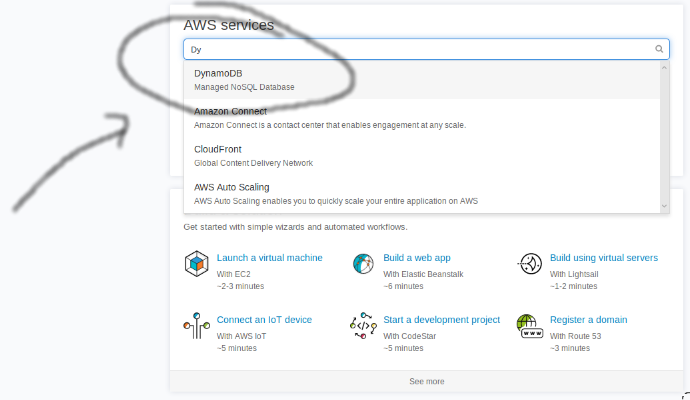
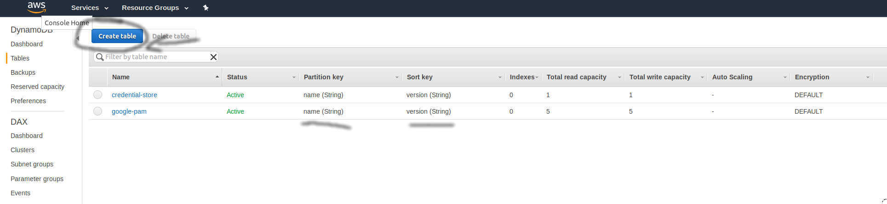
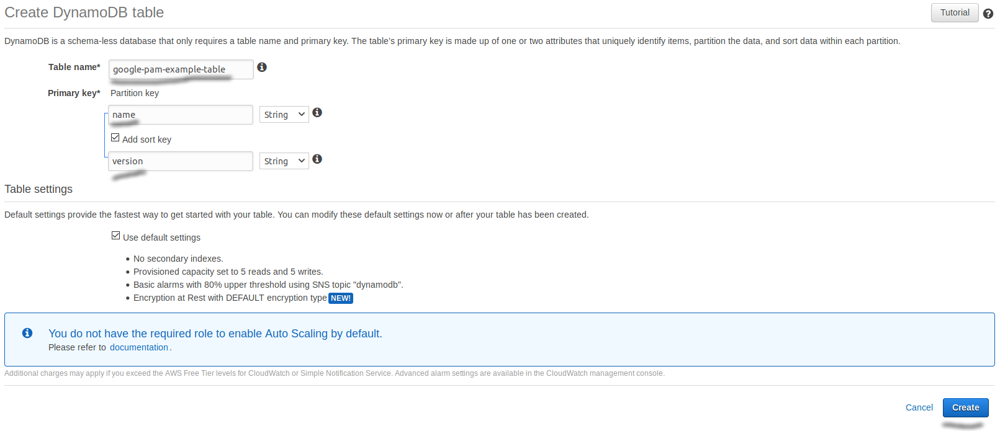
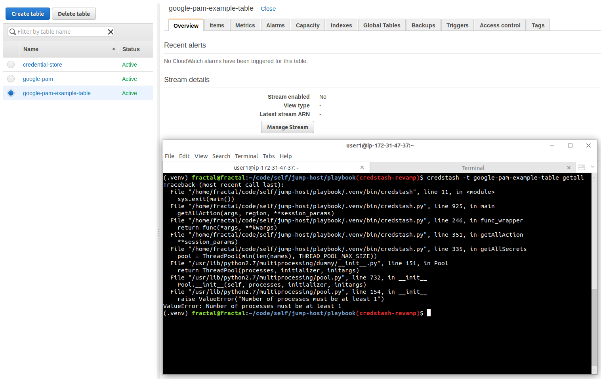
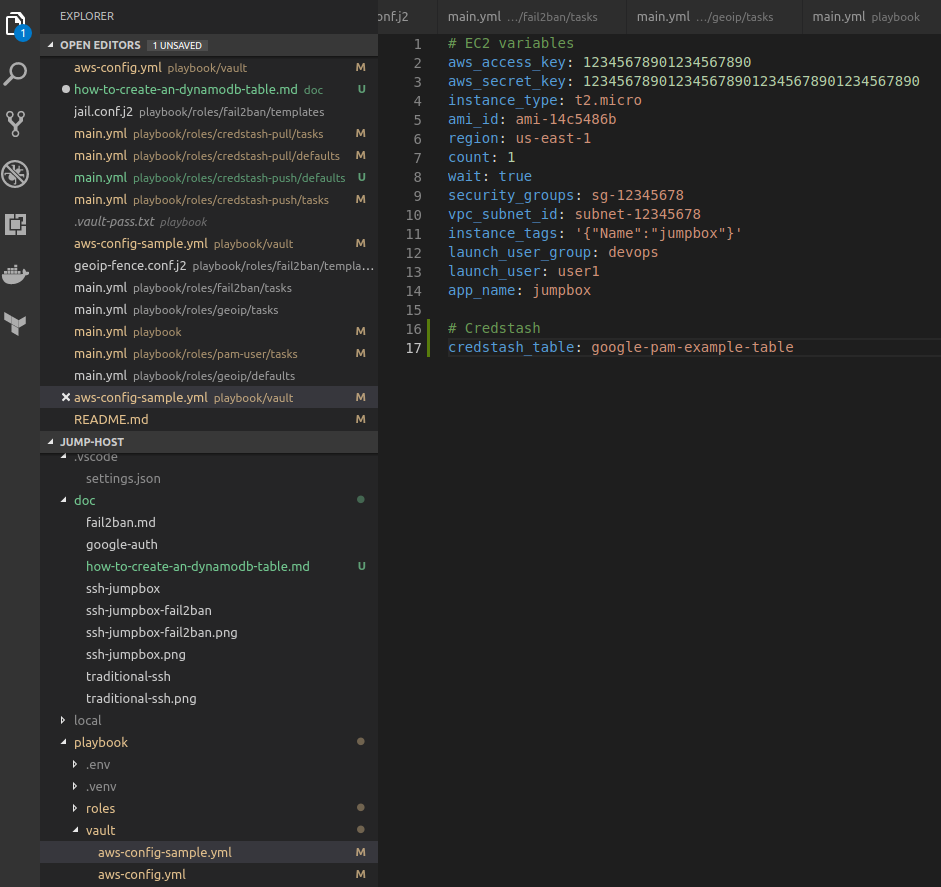

# How to setup a new DynamoDB table

This is a set of instructions on how to configure a new DynamoDB table for storing Google PAM data.

1. Log onto the [AWS Console](https://aws.amazon.com/console/). Select [DynamoDB](https://aws.amazon.com/dynamodb/), a key/value database as the Service to find.

    

1. Create a table in [DynamoDB](https://aws.amazon.com/dynamodb/).

    

1. Name the table properly, and setup two fields; **name** as the partition key and **version** as the sort key and hit **Create**.

    

1. The DynamoDB table will be created. By default, no items will be in credstash (empty table) when running `credstash -t <table-name> getall`.

    

1. Modify the configuration to use the table when creating the jumpbox. Be sure to modify the proper configuration file you're using.

    